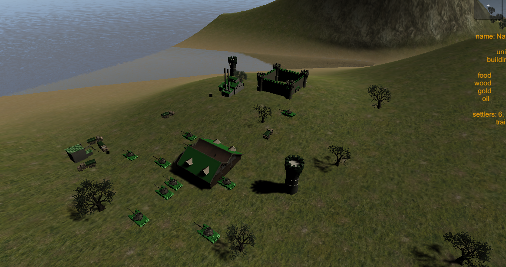
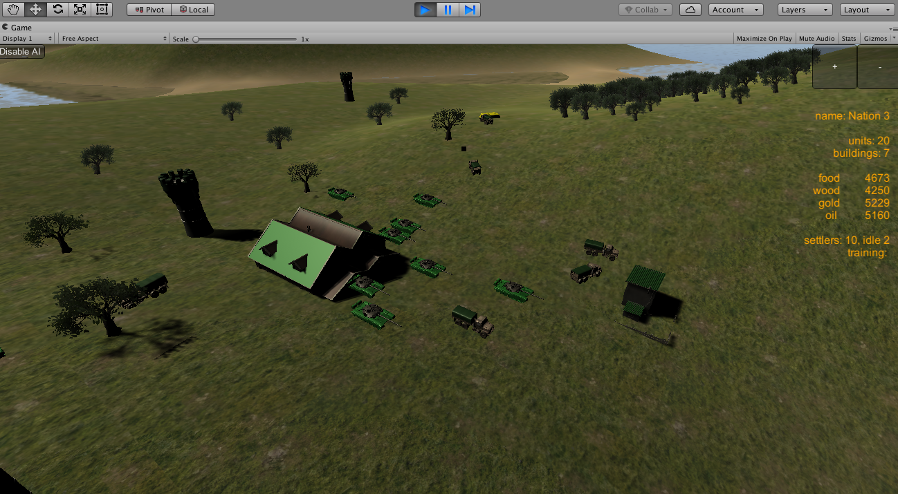
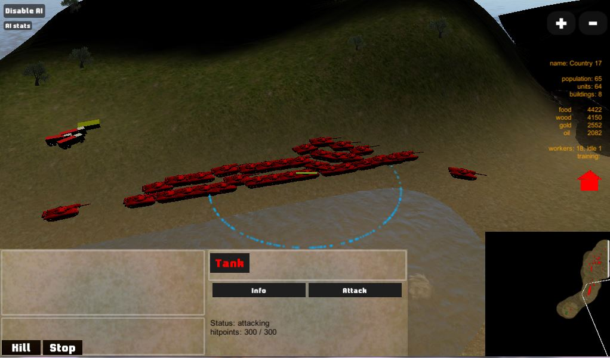
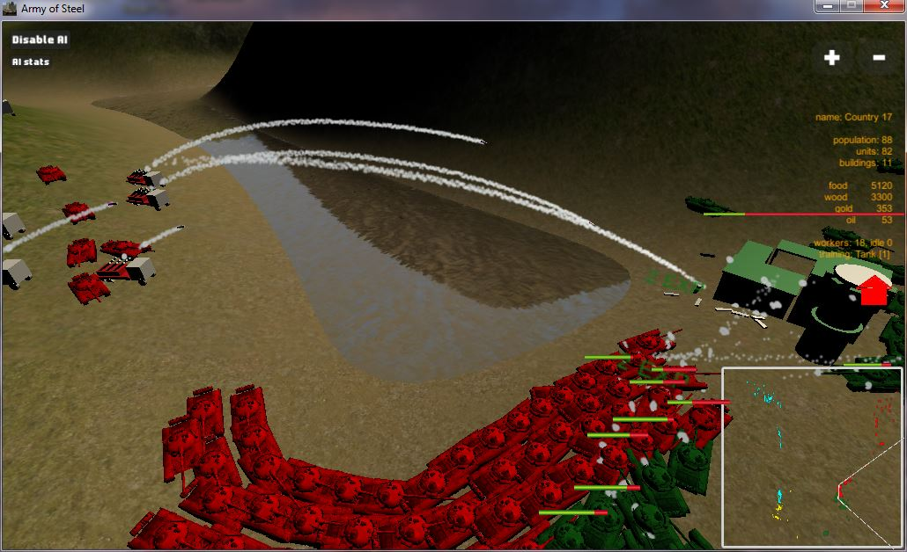

# Overview

RTS (real time strategy) game similar to StarCraft, built on top of [uGameCore](https://github.com/in0finite/uGameCore).

 

# Download

Download it from [gamejolt](https://gamejolt.com/games/ArmyOfSteel/329209). Experimental builds are available [here](https://drive.google.com/open?id=1ayVymOd0D9sjT7aw8YixeWvrMlJQrjSt).

 

# Gameplay videos

 

# Features

- Resource gathering
- Constructing buildings
- Training units
- Only workers can gather and construct
- Resources can be gathered directly (natural resources) or from buildings
- Selection - objects can be selected individually or by dragging a mouse around them
- Issuing commands : move, attack, gather, stop
- Building placement
- LOS - all objects have their line of sight, within which they can attack enemies
- Object properties - attack damage, movement speed, hitpoints, etc
- Projectiles - objects with ranged attack can shoot projectiles
- Works in multiplayer
- Fog of war - every friendly object reveals part of the map ; those visible parts are drawn into texture ; texture is used for custom terrain shader and minimap ; multithreaded ;
- Minimap - draws all units on the map into a smaller part of the screen, by rendering to texture with GL functions ; also applies fog of war texture
- AI: uses coeficients to determine which action to perform next ; it can construct, gather, train, attack, but can't defend itself
- Pathfinding - using unity's navigation
- and many more

 

# Interesting links

- [todo list](docs/todo.md)
- [some ideas](docs/ideas.md)

 

# Screenshots

